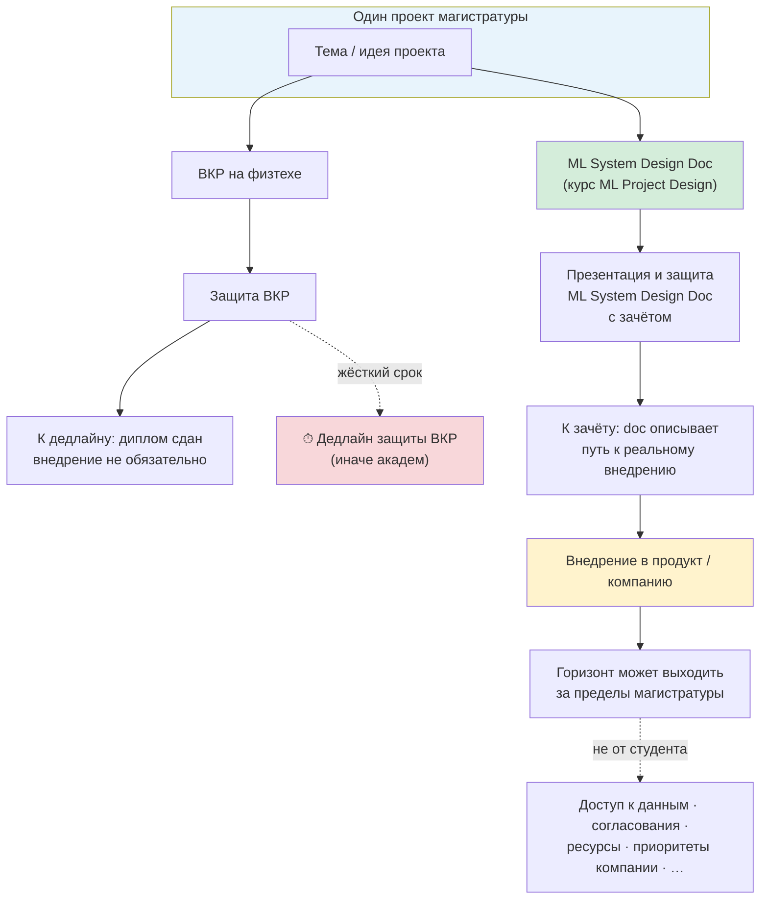
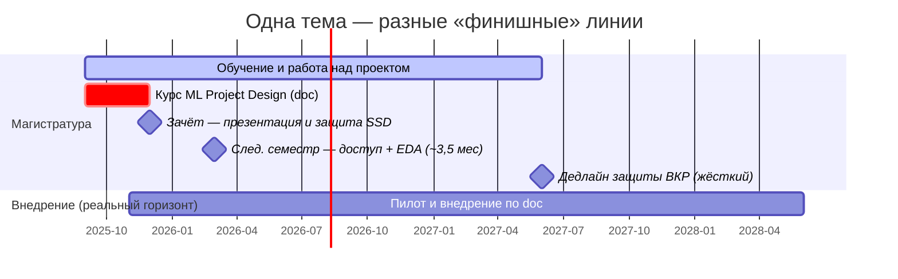

# Слайд: одна тема — два горизонта

> Показать на лекции 1 после блока «Установка курса». Связано с [[Основные установки курса]].

---

## Ключевая идея (тезисы на слайде)

1. **Одна тема:** проект магистратуры (ВКР) и ML System Design Doc курса — **один и тот же проект**.
2. **На зачёте курса** — **презентация и защита ML System Design Doc с зачётом**: doc составлен **под внедрение** этого проекта.
3. **Разница не в теме**, а в **горизонте и критериях:**
   - у **ВКР** — **жёсткий дедлайн** защиты (пропуск → академ);
   - **внедрение** в компании/продукт может занять **дольше магистратуры** — по причинам, часто **не зависящим от студента** (доступ к данным, согласования, ресурсы, приоритеты компании и т.д.).

---

## Схема (для проектора)

---

## Временная шкала (нижняя часть слайда)

*Подпись под шкалой:* «Doc готовит к внедрению; само внедрение может продолжаться после ВКР — и это нормально.»

---

## Таблица для студентов (можно оставить на слайде или раздать)

| | **ВКР (физтех)** | **Курс ML Project Design** |
|---|---|---|
| **Тема проекта** | Ваша тема магистратуры | **Та же** |
| **Что на зачёте** | Диплом / ВКР | **Презентация и защита** ML System Design Doc **с зачётом** |
| **Срок** | Жёсткий календарь вуза (защита ВКР) | Зачёт в конце семестра курса |
| **Роль внедрения** | К дедлайну ВКР — **не обязательно** | Doc проектирует **реальное внедрение**; к зачёту — обоснованный план и прогресс |
| **Горизонт внедрения** | Не формализован | Doc + roadmap; **EDA — след. семестр** (~3,5 мес после зачёта); внедрение может быть **дольше** обучения |

---

## Формулировка для озвучивания (~1 мин)

> Тема вашего проекта в магистратуре и тема design doc на этом курсе — **одна и та же**.
> На зачёте — **презентация и защита ML System Design Doc с зачётом**: doc **под внедрение**, не «абстрактный конспект».
> У ВКР есть **жёсткий дедлайн**; **полное внедрение** часто не укладывается в магистратуру — и это **нормально**, если doc честно описывает путь, риски и то, что уже сделано.
> Курс учит думать как про **реальный продукт**, а не только как про **сдачу в срок**.

---
flowchart LR
    T["Одна тема магистратуры"] --> VKR["ВКР"]
    T --> SDD["ML System Design Doc"]

    VKR --> D1["Защита ВКР ⏱ жёсткий дедлайн"]
    SDD --> D2["Защита doc зачёт курса"]

    D2 --> IMP["Внедрение → может быть дольше магистратуры"]

## Связанные материалы

- [[Критерии зачёта — ML System Design Doc]]
- [[Основные установки курса]]
- [[01 Вводное занятие]]
- [[01 Вводное занятие - сценарий]]
- [[Критерии зачёта — ML System Design Doc]]
